# FrontEnd-System-Design-
Comprehensive notes, visual breakdowns, and architectural patterns for frontend system design. Covers client-side architecture, core trade-offs, and practical frameworks to ace interviews and build scalable web applications.

# The RADIO Framework

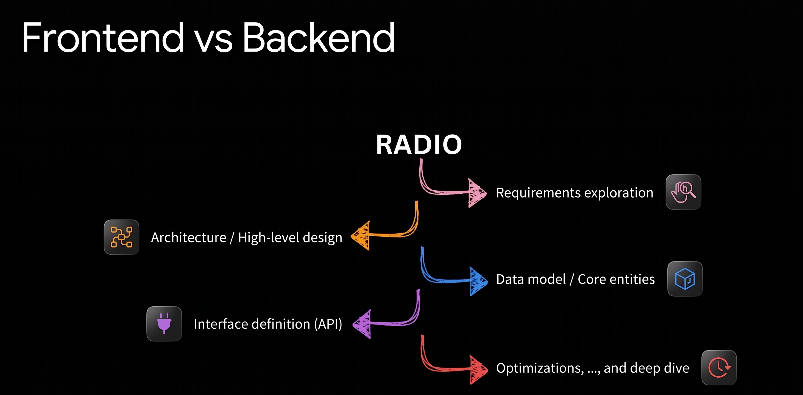

The **RADIO** framework is a simple, 5-step method to solve Frontend System Design problems during interviews or real projects[cite: 1, 6]. It helps you organize your thoughts before writing any code[cite: 1, 6].

### 1. R — Requirements exploration
Understand what you need to build before you start[cite: 1, 6]:
- **Functional requirements:** What features does the user see and use? (e.g., create a post, like a post, scroll infinitely).
- **Non-functional requirements:** Performance, fast load time, mobile support, offline mode, and accessibility (a11y).
- **Edge cases:** What happens if the internet disconnects? What if there are thousands of comments?

### 2. A — Architecture / High-level design
Draw the big picture of your app[cite: 1, 6]:
- How data moves between the client (browser) and the server[cite: 1, 6].
- Split the screen into main components (e.g., Feed, Post Card, Navigation bar)[cite: 1, 6].
- Choose the rendering strategy (e.g., Client-Side Rendering vs. Server-Side Rendering).

### 3. D — Data model / Core entities
Define how your data looks inside the app[cite: 1, 6]:
- **Main entities:** Object shapes for `User`, `Post`, `Comment`[cite: 1, 6].
- **Server state vs. UI state:**
  - **Server state:** Data coming from APIs (posts, profiles)[cite: 1, 6].
  - **UI state:** Local screen details (is a modal open? is it loading?).
- Keep your data clean and avoid duplicate data (normalization)[cite: 1, 6].

### 4. I — Interface definition (API)
Define how the frontend talks to the backend[cite: 1, 6]:
- Pick the communication type: REST API, GraphQL, or WebSocket (for real-time updates)[cite: 1, 6].
- Define endpoints, request parameters, and response formats[cite: 1, 6].
- Plan pagination: how to load more items when scrolling (page numbers vs. cursor-based)[cite: 1, 6].

### 5. O — Optimizations & Deep dive
Make your application fast, safe, and reliable[cite: 1, 6]:
- **Performance:** Virtual lists (render only visible items), lazy loading images, smaller bundle sizes[cite: 1, 6].
- **User experience (UX):** Optimistic updates (show the like button active immediately before the server responds)[cite: 1, 6].
- **Error handling:** Show clear error messages, auto-retry failed requests, and secure the app against attacks like XSS[cite: 1, 6].

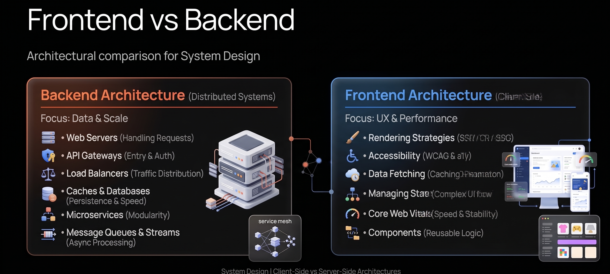
## Frontend vs Backend: System Design Comparison

When we talk about System Design, the frontend and backend have different goals and focus areas[cite: 8, 9]. The backend focuses on distributed systems and servers, while the frontend focuses on client-side architecture and user experience[cite: 8, 9].

### Backend: Distributed Systems (Focus: Data & Scale)
- **Web Servers:** Receive and handle incoming HTTP/network requests[cite: 8, 9].
- **API Gateways:** Single entry point for routing, authentication, and security[cite: 8, 9].
- **Load Balancers:** Distribute traffic across multiple servers to prevent crashes[cite: 8, 9].
- **Caches & Databases:** Store data safely (SQL/NoSQL) and speed up reads using cache (e.g., Redis)[cite: 8, 9].
- **Microservices:** Split the system into small, independent services[cite: 8, 9].
- **Message Queues & Streams:** Handle background tasks asynchronously (e.g., Kafka, RabbitMQ)[cite: 8, 9].

### Frontend: Client-Side Architecture (Focus: UX & Performance)
- **Rendering Strategies:** Choose how to display pages (SSR, CSR, SSG, or Hydration)[cite: 8, 9].
- **Accessibility (a11y):** Ensure the application is usable for everyone, including users with disabilities[cite: 8, 9].
- **Data Fetching:** Manage caching, pagination, polling, and network states on the client[cite: 8, 9].
- **Managing State:** Handle complex local and server data flows (e.g., Redux, Zustand, React Query)[cite: 8, 9].
- **Performance & Core Web Vitals:** Keep the web app fast, optimize bundle sizes, and prevent UI lag[cite: 8, 9].
- **Components:** Design reusable, modular, and maintainable UI logic[cite: 8, 9].

 ### FaceBook System Design
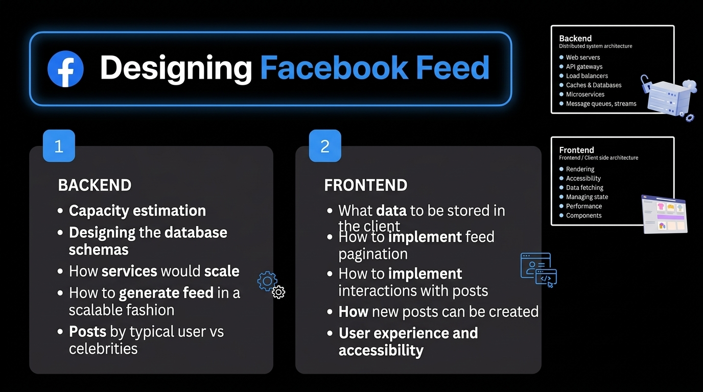

## Case Study: Designing Facebook Feed

To see the difference in practice, here is how backend and frontend engineers look at the same product (Facebook Feed) differently[cite: 10]:

### 1. Backend Scope
- **Capacity estimation:** Calculate storage, bandwidth, and read/write requests per second[cite: 10].
- **Designing database schemas:** Define tables and relationships for users, posts, and feeds[cite: 10].
- **Service scalability:** Scale services horizontally and handle high server traffic[cite: 10].
- **Scalable feed generation:** Fan-out strategies to deliver millions of posts efficiently[cite: 10].
- **Typical users vs. celebrities:** Handle users with millions of followers differently to protect servers[cite: 10].

### 2. Frontend Scope
- **Client-side data storage:** Decide what data stays in memory, LocalStorage, or IndexedDB[cite: 10].
- **Feed pagination:** Implement infinite scrolling and virtualized lists to save device memory[cite: 10].
- **Post interactions:** Handle likes and comments with instant (optimistic) feedback[cite: 10].
- **Creating new posts:** Autosave drafts and compress media before uploading[cite: 10].
- **User experience & accessibility:** Ensure smooth rendering, fast loading, and screen-reader support[cite: 10].

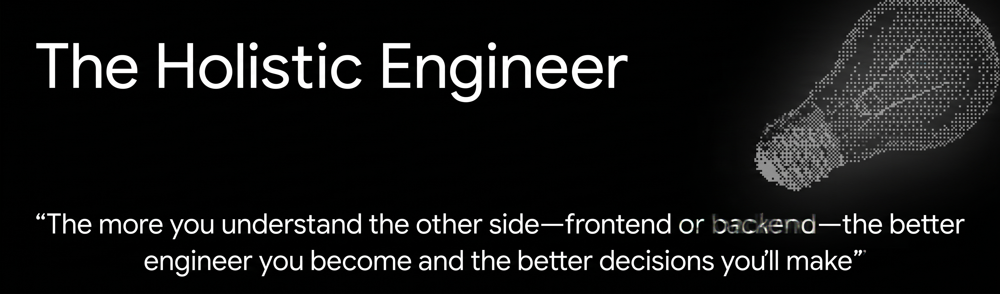

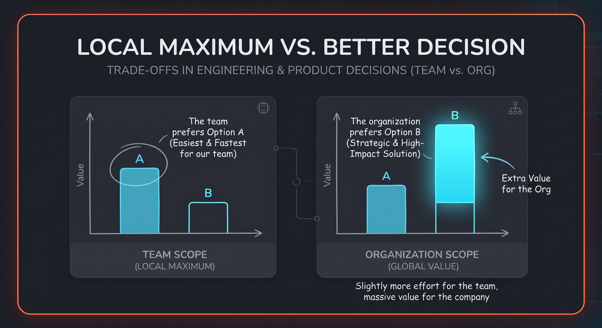

## Local Maximum vs. Better Decision (Org Value)

Sometimes engineers make decisions that are great for their own team, but not great for the whole company (organization).

- **Team Scope (Local Maximum):**
  - The team looks only at their own effort.
  - **Option A** looks better because it is faster, easier, and comfortable for the team right now.
  - **Option B** looks worse because it takes extra effort from the team.

- **Organization Scope (Global Value):**
  - When looking at the whole company, **Option B** gives huge extra value.
  - Even if Option B is slightly harder for one team, it saves money, speeds up other teams, and improves the overall system.

> **Key Rule:** A great senior engineer does not only optimize for their own comfort; they optimize for the whole organization.

## Software Architecture: Definitions & Concepts

### 1. What is Software Architecture? (4 Definitions)

Software architecture has multiple perspectives depending on how you look at the system[cite: 7, 8]:

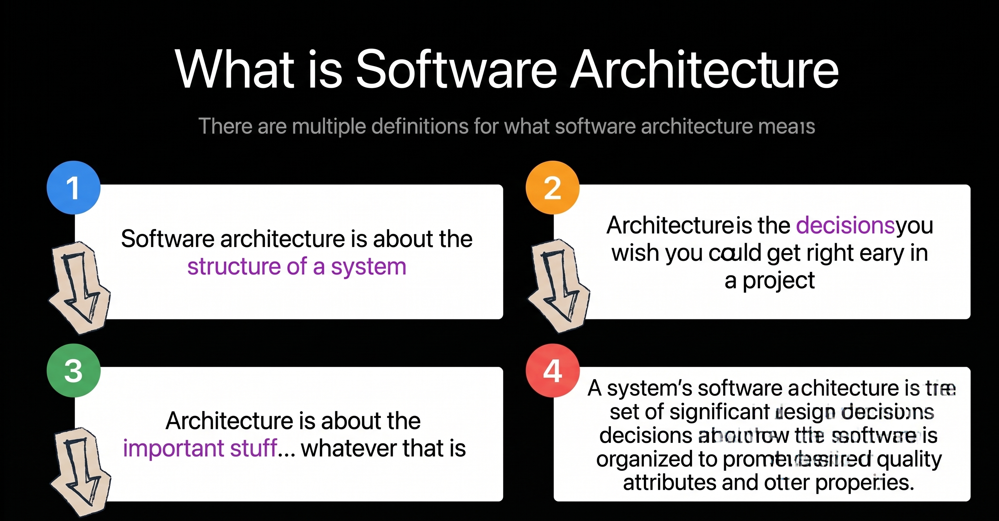

1. **System Structure:** Software architecture is about the structure of a system[cite: 7, 13].
2. **Early Critical Choices:** Architecture is the decisions you wish you could get right early in a project[cite: 8, 13].
3. **Core Priorities:** Architecture is about the important stuff... whatever that is[cite: 9, 13].
4. **Organizing for Quality:** Architecture is the set of significant design decisions about how the software is organized to promote desired quality attributes and properties[cite: 10, 13].

---

### 2. Architecture vs. Design

Architecture and design are not completely separate things; they exist on a continuous spectrum from high-level vision to detailed execution[cite: 14, 15]:

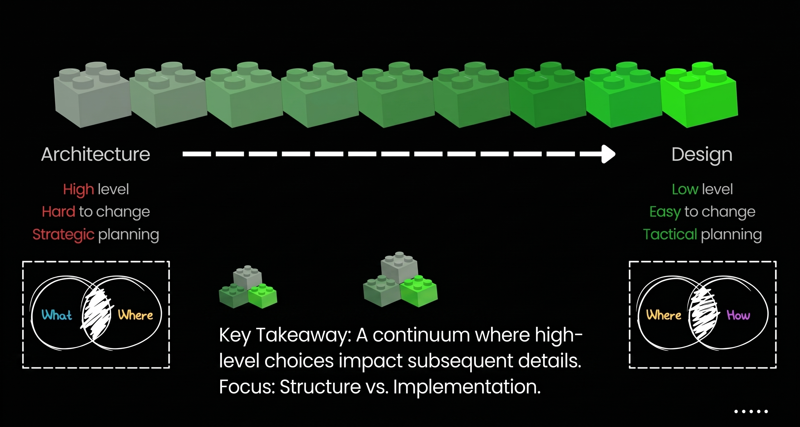

| Aspect | Architecture (High-Level) | Design (Low-Level) |
| :--- | :--- | :--- |
| **Questions Answered** | **What & Where** (Core modules and system boundaries)[cite: 14] | **Where & How** (Implementation details and patterns)[cite: 14] |
| **Flexibility** | **Hard to change** (Expensive and time-consuming to alter later)[cite: 14] | **Easy to change** (Local refactoring and quick iterations)[cite: 14] |
| **Planning Scope** | **Strategic planning** (Long-term system health and scalability)[cite: 14] | **Tactical planning** (Feature building and day-to-day coding)[cite: 14] |

---

### 3. Why Do We Need to Talk About This?

Distinguishing between architectural decisions and design decisions protects the engineering team and the product[cite: 16]:

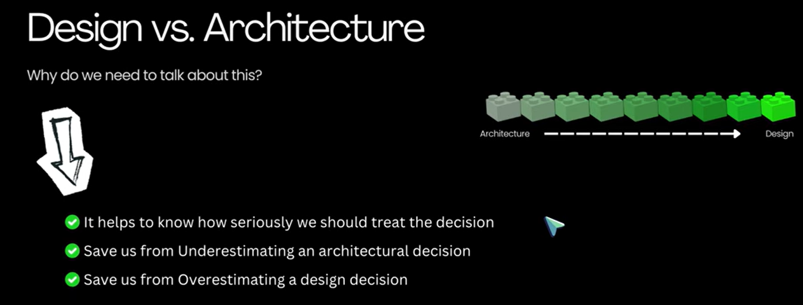

- **Calibrate Decision Weight:** It helps teams understand how seriously they must treat each choice before committing to it[cite: 16].
- **Avoid Underestimating Architecture:** Prevents making hasty, unresearched choices on fundamental system structures that are painful and costly to rewrite later[cite: 14, 16].
- **Avoid Overestimating Design:** Prevents "analysis paralysis" and time wasted debating small, tactical implementation details that can easily be changed at any time[cite: 14, 16].

### RADIO System.. 1 ) Requirement Exploration 

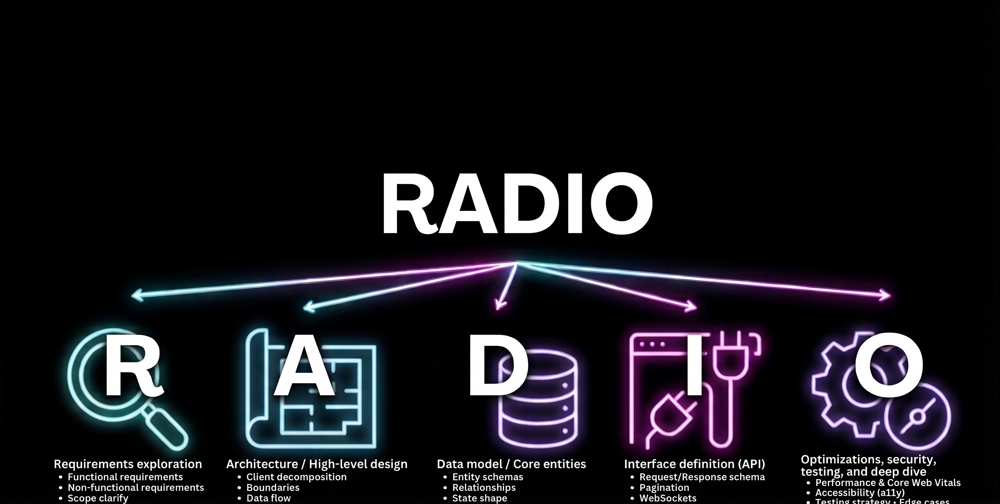
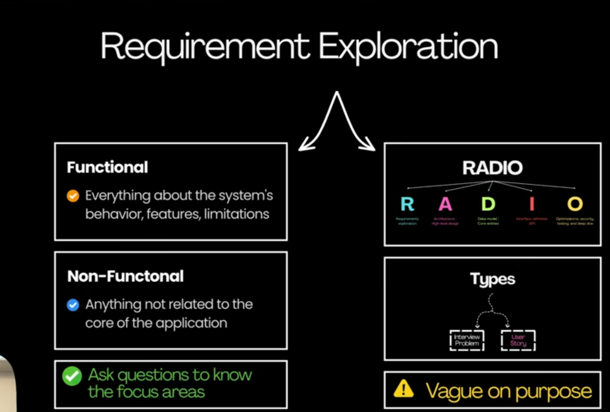

## Step 1: Requirement Exploration (R)

The primary goal of Requirement Exploration is to **eliminate ambiguity by asking targeted, high-impact questions** before writing code or drafting an architectural diagram.
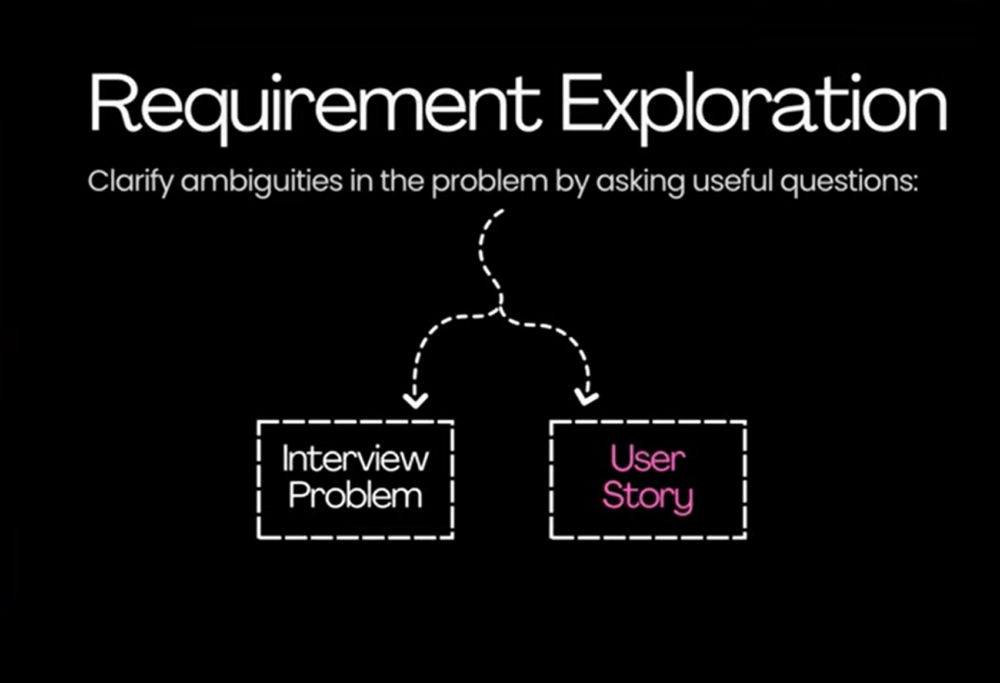

### Dealing with Open-Ended Problems

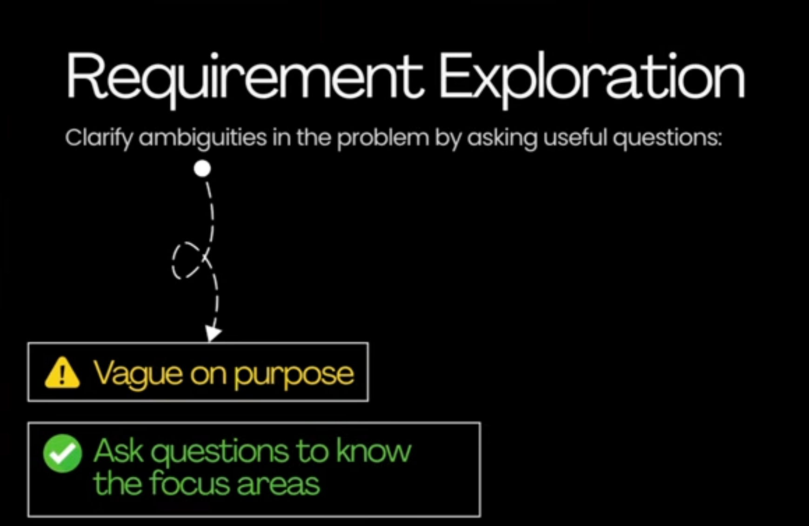

In a real-world project or system design interview, problem statements are often intentionally vague (e.g., *"Design an image feed"* or *"Build an autocomplete search component"*):
- **Why interviewers do this:** They want to observe your thought process, see how you handle uncertainty, and verify that you don't make blind assumptions.
- **Engineering mindset:** Jumping straight into component hierarchies or tech stacks is a red flag. Strong engineers pause, clarify the scope, establish hard boundaries, and align on expectations first.

---

### The Two Core Perspectives of Requirements

Requirement exploration breaks down into two complementary directions:

1. **Interview Problem (Technical Scope & Constraints):**
   - Focuses on engineering limitations, scale, and environment boundaries.
   - Clarifies supported devices (desktop vs. mobile web vs. hybrid), network conditions (offline-first vs. low latency), and volume targets (e.g., rendering thousands of items via virtualization instead of dumping everything into the DOM).

2. **User Story (UX & Interaction Flow):**
   - Focuses on user interactions and how data surfaces in the interface.
   - Clarifies step-by-step user behavior: what triggers a search, whether input debouncing is required, how filtering functions, and how empty, error, or loading states appear.

---

### Functional vs. Non-Functional Requirements

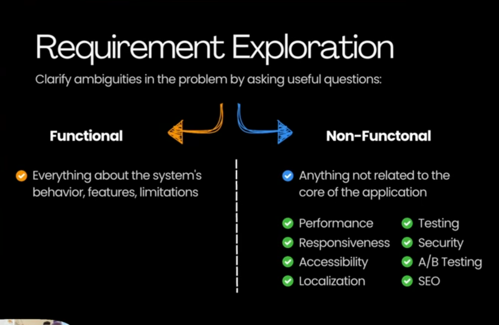

To structure questions effectively, group requirements into two distinct categories:

| Category | Definition | Key Frontend Questions & Examples |
| :--- | :--- | :--- |
| **Functional Requirements** | What the system **must do** (features & user flows). | - What core actions can the user perform (read, create, edit, delete)? - What are the primary UI states (loading, empty, success, error)? - What data filters and sorting options are required? |
| **Non-Functional Requirements** | How the system **must perform** (quality & constraints). | - **Performance:** What are the target Core Web Vitals (LCP, FID/INP, CLS) and initial load budgets? - **Scalability:** How should the UI handle massive datasets (pagination, infinite scroll, windowing)? - **Reliability & Offline:** Does the app need offline support or optimistic updates? - **Accessibility & Devices:** Does it require keyboard navigation, screen reader support (ARIA), and cross-browser resilience? |

## FaceBook Feed Ex.

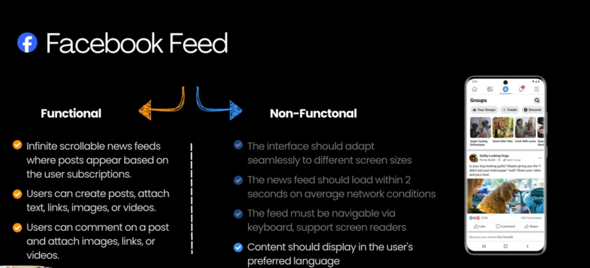